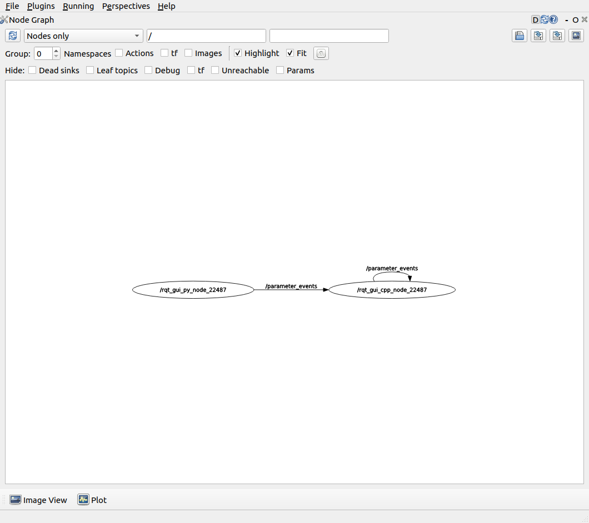

对Bubble进行调试
==============================

**Goal:** 通过使用vscode内的插件对Bubble的功能包进行调试

.. contents:: 目录
   :depth: 2
   :local:

先决条件
--------------------------------------------
您具备了ROS2的基础知识， 并且已完成 `源码构建 <getting_started/通过源码构建.html>`__  内的所有步骤。

在vscode中使用ROS插件调试
--------------------------------------------
在vscode中需要依靠扩展来对ROS2进行调试。在ROS扩展中共有两种调试方式launch和attach。launch调试是直接启动launch文件进行调试，类似于原生调试流程。
attach调试不同于launch调试，它是在程序运行阶段附加到进程上来为ROS进行调试,若结束调试不会对进程产生影响。

生成调试配置文件
################################################

若为首次使用ros插件进行调试，并且.vscode目录下不包含settings.json文件。请进入运行和调试界面点击下拉菜单选择添加配置，此时会自动在 .vscode目录下生成settings.json文件。
若.vscode目录下包含settings.json文件，请忽视此步骤。

使用Launch启动调试
################################################

配置launch
~~~~~~~~~~~~~~~~~~~~~~~~~~~~~~~
在settings.json文件中点击添加配置,下拉选择ROS:Launch选项 会在 "configurations": [] 中自动添加,

    .. code-block:: python 

        {
            "name": "ROS: Launch",
            "type": "ros",
            "request": "launch",
            "target": "absolute path to launch file"
        }

修改其中的"target"为所需要启动的launch文件路径。
   
    .. code-block:: python 

        {
            "name": "ROS: Launch",
            "type": "ros",
            "request": "launch",
            "target": "src/bubble_contrib/bubble_aiming/launch/aiming_launch.py"
        }

运行launch
~~~~~~~~~~~~~~~~~~~~~~~~~~~~~~~~

1. 重新进入运行和调试界面点击下拉菜单选择ROS:Launch, 若没有对应选项请检查第一步是否完成。
   
   .. image:: asset/ros_attach.png

2.  在选择ROS:Launch后: Launch之后会运行对应的launch文件。
   
2. 进行断点调试。
   

使用Attach启动调试
################################################

配置attach
~~~~~~~~~~~~~~~~~~~~~~~~~~~~~~~
在settings.json文件中点击添加配置,下拉选择ROS:Attach选项 会在 "configurations": [] 中自动添加       
        
    .. code-block:: python
        
        {
            "name": "ROS: Attach",
            "type": "ros",
            "request": "attach"
        }

运行attach 
~~~~~~~~~~~~~~~~~~~~~~~~~~~~~~~
1. 首先运行待调试的节点 如启动bubble_core包中的bcp_core节点。
   
    .. code-block:: bash

        ros2 launch src/bubble_core/bubble_protocol/launch/bcp_api_core_launch.py

2. 重新进入运行和调试界面点击下拉菜单选择ROS:Attach, 若没有对应选项请检查第一步是否完成。
   
   .. image:: asset/ros_attach.png

3. 在选择ROS:Attach后会跳出选择框选择编程语言，根据要调试的节点内部使用的编程语言进行选择。

   .. image:: asset/python.png

   
4. 在选择完编程语言后会跳出选择进程的选择框，此处选择节点名称即bcp_core。

   .. image:: asset/bcp_core.png

5. 进行断点调试。

在rqt中调试
--------------------------------------------
RQt 是一个图形用户界面框架，以插件的形式实现了各种工具和界面。 可以在 RQt 中将所有现有的 GUI 工具作为可停靠窗口进行运行。 
一般使用rqt中的 Image View、Node Graph、Topic Monitor和Dynamic Reconfigure插件。

rqt使用
################################################
在终端内输入

    .. code-block:: bash

        rqt

在首次运行rqt后，窗口将为空白。需从顶部的菜单栏中选择Plugins > Introspection > Node Graph用以查看node节点关系图。

.. note:: 可能需要一些时间 rqt 来定位所有插件本身。 如果单击 Plugins ，但没有看到 Node Graph 或任何其他选项，则应关闭 rqt ，输入命令 rqt --force-discover在您的终端中。 

    
插件介绍
################################################

Image View
~~~~~~~~~~~~~~~~~~~~~~~~~~~~~~~
用于显示图像信息， 一般用于查看相机发送的图像是否正常。
   .. image:: asset/Image_View.png

Node Graph 
~~~~~~~~~~~~~~~~~~~~~~~~~~~~~~~
用于查看node节点的关系图， 一般用于检查节点与节点是否正常建立联系。
   .. image:: asset/Node_Graph.png

Topic Monitor 
~~~~~~~~~~~~~~~~~~~~~~~~~~~~~~~
用于查看发布的主题内的数据，一般用于查看主题内的数据是否正常。
   .. image:: asset/Topic_Monitor.png

   .. image:: asset/Topic_Monitor2.png

Dynamic Reconfigure
~~~~~~~~~~~~~~~~~~~~~~~~~~~~~~~
用于调试使用，一般用于对各个参数的值进行修改。

   .. image:: asset/Dynamic_Reconfigure.png

