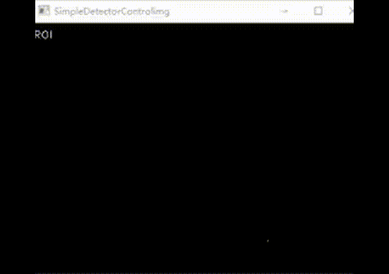
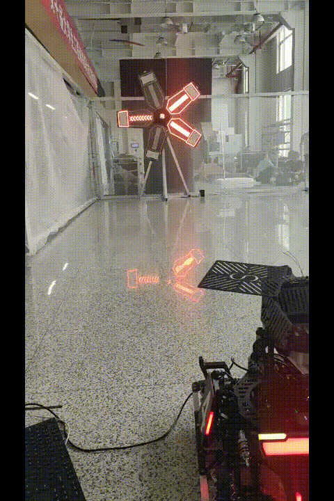

模块运行效果实例
=============================
各个模块测试效果图

机器人自瞄
--------------------------------------- 
运动补偿实战
^^^^^^^^^^^^^^^^^^^^^^^^^^^^^^^^^^^^^^^^^

击打能量机关
--------------------------------------- 

小能量机关测试
^^^^^^^^^^^^^^^^^^^^^^^^^^^^^^^^^^^^^^^^^

大能量机关测试
^^^^^^^^^^^^^^^^^^^^^^^^^^^^^^^^^^^^^^^^^
.. image:: asset/大能量机关测试.gif

大能量机关实战
^^^^^^^^^^^^^^^^^^^^^^^^^^^^^^^^^^^^^^^^^
.. image:: asset/实战能量机关.gif

击打旋转前哨站
--------------------------------------- 
旋转前哨站测试
^^^^^^^^^^^^^^^^^^^^^^^^^^^^^^^^^^^^^^^^^
.. image:: asset/旋转前哨站.gif

运动补偿
--------------------------------------- 
运动补偿实战
^^^^^^^^^^^^^^^^^^^^^^^^^^^^^^^^^^^^^^^^^
.. image:: asset/实战哨兵.gif