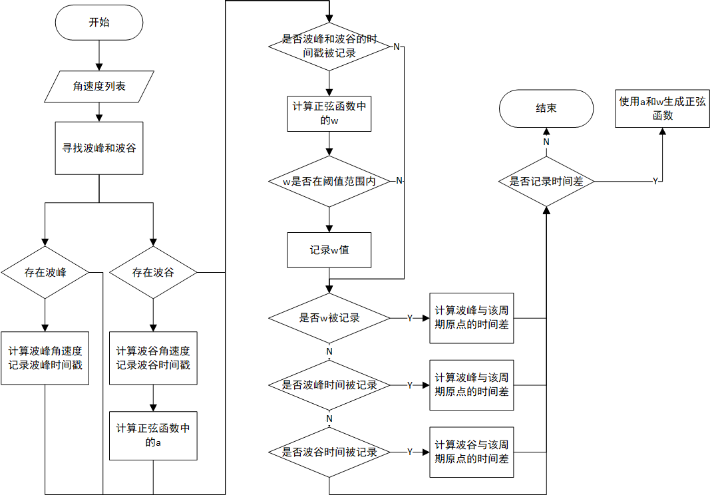

RMUC2022大能量机关预测器
=================================================
:Authors:
    HarryWen

:Contact: 858601365@qq.com
:Date: 2022/09/8
:Copyright: This document has been placed in the public domain.

概述
--------------------------------------------------
在RMU竞赛中,大能量机关是最为重要的视觉任务,同样需要确保场上击打响应快速且准确。该文档将阐述如何实现能量机关预测器的。

.. note:: 能量机关预测器的相关代码位于 ``bubble_contrib/bubble_aiming/predictor/largeRunePredictor.py`` 模块下

1. 问题分析
-------------------------------------------------

大能量机关旋转机制
################################################
能量机关转速按照三角函数呈周期性变化。速度目标函数为：:math:`a*\sin(\omega * t) + b` ,其中 :math:`spd` 的单位为
:math:`rad/s` , :math:`t` 的单位为 :math:`s`, :math:`a` 的取值范围为 :math:`[0.780,1.045]` , :math:`\omega` 的取值范围为 :math:`[1.884,2.000]` , :math:`b` 始终满足 :math:`b=2.090-a` 。
每次大能量机关进入可激活状态时,所有参数重置,其中 :math:`t` 重置为 :math:`0` , :math:`a` 和 :math:`\omega` 重置为取值范围内任意值。

大能量机关的转速呈三角函数周期性变化,不同于2021赛季的大能量机关,今年函数内a和ω的随机取值,而这两者都与波峰和波谷有关。故思考是否可以利用三角函数的特性即波峰和波谷信息来获得能量机关可激活状态的目标函数。

2. 模型建立
--------------------------

2.1 坐标系定义
################################################
坐标系定义原则上参考 `REP103 <https://www.ros.org/reps/rep-0103.html>`__， 但针对RMU进行了一定的简化。

能量机关坐标系以能量机关R标作为极坐标系原点。不同于极坐标系， 此处从参考系x轴正方向逆时针旋转到x轴负方向所经过的角度范围为 :math:`\theta \varepsilon [0,180]`  顺时针旋转到x轴负方向所经过的角度范围为 :math:`\theta \varepsilon [0,-180]`。

2.2 符号说明
################################################

.. list-table::
    :widths: 5 25
    :header-rows: 1

    * - 符号
      - 符号说明
    * - :math:`peak`
      - 函数的波峰值
    * - :math:`trough`
      - 函数的波谷值
    * - :math:`T`
      - 函数的周期
    * - :math:`t_gap`
      - 波峰和波谷相较于该周期原点的时间差
    * - :math:`t_peak`
      - 波峰时间戳
    * - :math:`t_trough`
      - 波谷时间戳

2.3 数学推导
################################################

函数\omega计算

    正弦函数参数: :math:`a \in [0.78,1.045], b \in [0,0.53], \omega \in [1.884,2]`
        
    | 由正弦函数周期计算公式：:math:`T = 2 \pi / \omega ,\omega \in [1.884,2]` 可得:  
    |   :math:`T \in [3.14,3.335]`
    |
    | 由 :math:`spd = a*\sin(\omega * t) + b, \sin(\omega*t) \in [-1,1]` 可得:
    |   :math:`spd \in [2.090-2a,2.090]`
    |
    | :math:`T = 2 * |t_peak - t_trough|, \omega = \pi / | t_peak - t_trough |`

    由此可以看出 a 可以由函数的波谷获得。\omega 可以通过函数周期T获得。 

函数波峰和波谷与该周期原点的时间差计算

    
    | :math:`peak_offset = \frac{\pi}{2 * \omega}` , :math:`trough_offset = \frac{3 * \pi}{2 * \omega}`
    |
    | 由 :math:`T = 2 \pi / \omega` 和正弦函数特性：
    |   :math:`peak_offset = \frac{1}{4}*T = \frac{\pi}{2 * \omega}`
    |   :math:`trough_offset = \frac{3}{4}*T = \frac{3 * \pi}{2 * \omega}`
    |
    | 当波峰时: :math:`t_gap = t_peak - peak_offset`
    | 当波谷时: :math:`t_gap = t_trough - trough_offset`

3. 流程介绍
--------------------------------------------------
.. image:: asset/大能量机关预测器.png

3.1 数据准备
################################################

该部分可以参考小能量机关预测器中的数据准备

3.2 数据滤波处理
################################################

观察计算所得角速度的波形图,发现其中存在大量杂波,破坏了函数的波形,导致无法准确找到函数的波峰和波谷。相较于函数的原始信号这些杂波属于高频信号,故此处使用低通滤波对波形中的高频信号进行滤波处理,从而消除杂波起到平滑曲线的作用。

核心代码实现
~~~~~~~~~~~~~~~~~~~~~~~~~~~~~~~~~~~~~~~~~~~~~~~

lowPassFilter()函数用于对数据进行低通滤波, filterVel()用于对角速度滤波和数据记录

    .. code-block:: python

      def lowPassFilter(fps, signal_fps, data):
          b, a = signal.butter(fps, signal_fps, 'lowpass')
          filtered_data = signal.filtfilt(b, a, data)
          return filtered_data

      def filterVel(self, rune_list, signal_fps, record_index):
          vel_list = [i[0].get_velocity() for i in rune_list]  # 速度列表
          filter_vel = lowPassFilter(2, signal_fps, vel_list)
          if self.filter_time_list.size() == 0:
              for i in range(0, len(rune_list)+record_index):
                  self.filter_time_list.append(rune_list[i][0].get_stamp())
                  self.filter_vel_list.append(filter_vel[i])
          else:
              self.filter_time_list.append(rune_list[record_index][0].get_stamp())
              self.filter_vel_list.append(filter_vel[record_index])

          return self.filter_time_list, self.filter_vel_list

此处使用scipy实现低通滤波的处理, 具体使用可参考scipy `官方文档 <https://docs.scipy.org/doc/scipy/reference/generated/scipy.signal.butter.html>`__ 。

    .. code-block:: python

        b, a = signal.butter(fps, signal_fps, 'lowpass')
        filtered_data = signal.filtfilt(b, a, data)

由于低通滤波需要一定的数据,为了加快自瞄启动速度,在第一次进行滤波处理的时候将所有数据进行记录。此处将时间戳和速度分别记录在两个列表内,没有使用自定义的数据类型

    .. code-block:: python

        if self.filter_time_list.size() == 0:
          for i in range(0, len(rune_list)+record_index):
            self.filter_time_list.append(rune_list[i][0].get_stamp())
            self.filter_vel_list.append(filter_vel[i])

3.3 波形分析
################################################

由问题分析可知, 函数中 :math:`a,w,b` 是通过波峰和波谷计算所得。所以波形分析主要目标是找到角速度波形曲线中的波峰和波谷。

寻找波峰
~~~~~~~~~~~~~~~~~~~~~~~~~~~~~~~~~~~~~~~~~~~~~~~
通过设定波峰的阈值和最小水平距离来筛选出所有符合的波峰,最后获取所有波峰中最新时刻的波峰。
    .. code-block:: python
   
      def findPeak(data_array: np.ndarray, thres: float) -> Optional[int]:
          peak_index = None
          peaks_index_list, peaks_dict = signal.find_peaks(
              data_array, height=thres, distance=20) 
          if len(peaks_index_list) != 0:
              peak_index = np.argmax(peaks_dict["peak_heights"])
              if 20 >= peak_index or peak_index >= len(data_array) - 20:
                  peak_index = None
          return peak_index

寻找波谷
~~~~~~~~~~~~~~~~~~~~~~~~~~~~~~~~~~~~~~~~~~~~~~~
首先对波形取反, 即将波形沿x轴镜像翻转。然后流程和寻找波峰相同,最后得到波谷。
    .. code-block:: python
   
      def findTrough(data_array: np.ndarray, thres: float) -> Optional[int]:
        trough_index = None
        negative_data_array = np.negative(data_array)  # 数组取相反数
        troughs_index_list, troughs_dict = signal.find_peaks(
            negative_data_array, height=-thres, distance=20)
        if len(troughs_index_list) != 0:
            trough_index = np.argmin(troughs_dict["peak_heights"])
            if 20 >= trough_index or trough_index >= len(data_array) - 20:
                trough_index = None
        return trough_index

3.4 计算函数的 :math:`a,w,b`
################################################
计算流程请参考

3.5 目标预测
################################################
为保证计算的统一性,此处的时间差都是相较与该周期的原点进行计算的。

当前时间与当前周期原点的时间差计算
~~~~~~~~~~~~~~~~~~~~~~~~~~~~~~~~~~~~~~~~~~~~~~~

根据上述公式获得波峰和波谷相较于该周期原点的时间差。然后将当前的时间减去计算获得的值,从而获得时间差。
   
    .. code-block:: python

        def alignTime(self, pres_time, peak_time, trough_time, w):
            if peak_time > trough_time:
                t = math.pi / (2 * w)
                aligned_time = pres_time - (peak_time - t)
            else:
                t = 3 * math.pi / (2 * w)
                aligned_time = pres_time - (trough_time - t)
            return aligned_time

预测角度计算
~~~~~~~~~~~~~~~~~~~~~~~~~~~~~~~~~~~~~~~~~~~~~~~

为简化问题此处采用固定的预测时间来计算预测角度。然后对 :math:`a*\sin(\omega * t) + b` 求定积分,将时间差加上设定的预测时间作为积分上限,将时间差的值作为积分的下限,积分获得预测角度。
    
    .. code-block:: python
        
        predict_radian, _ = integrate.quad(sine_func, aligned_time, aligned_time + predict_time)

计算预测矩形框的中心和目标框
################################################

此处可参考小能量机关预测器中的目标预测。
