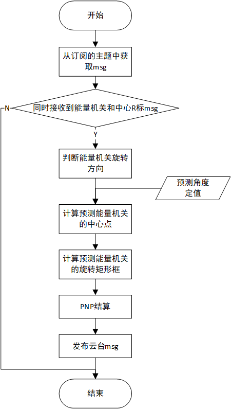

RMUC2022小能量机关预测器
=================================================
:Authors:
    HarryWen

:Contact: 858601365@qq.com
:Date: 2022/09/8
:Copyright: This document has been placed in the public domain.

概述
-----------------------------------------------------------------
在RMU竞赛中，小能量机关是仅此与大能量机关的极为重要的视觉任务，需要确保场上击打响应快速且准确。由于小能量机关在2021赛季就能完成击打任务，该文档将阐述今年是如何减少系统响应时间实现更加快速的击打的。

.. note:: 能量机关预测器的相关代码位于 ``bubble_contrib/bubble_aiming/predictor/smallRunePredictor.py`` 模块下

问题分析
--------------------------

小能量机关旋转机制
################################################

    小能量机关的旋转方向随机，转速固定为 10RPM。

在2021赛季的做法是计算当前转动的角速度对该值进行滤波处理，从而获得平均角速度用于预测。而进行滤波处理就需要有一定的数据，从而增加了系统响应时间。
今年为减少响应时间采用固定的角度预测值从而减少了滤波处理的步骤，达到缩短响应时间的目的。两个方法有各自的利弊，前者有跟高的鲁棒性，后者响应跟快速，具体怎么选择根据需求进行选择。

坐标系定义
---------------------------
坐标系定义原则上参考 `REP103 <https://www.ros.org/reps/rep-0103.html>`__， 但针对RMU进行了一定的简化。

能量机关坐标系以能量机关R标作为极坐标系原点。不同于极坐标系， 此处从参考系x轴正方向逆时针旋转到x轴负方向所经过的角度范围为 :math:`\theta \varepsilon [0,180]`  顺时针旋转到x轴负方向所经过的角度范围为 :math:`\theta \varepsilon [0,-180]`。

流程
--------------------------------------------------

数据准备
--------------------------------------------------

在目标预测部分需要使用能量机关当前旋转所在角度、旋转方向和角速度，故此处先进行数据准备。

旋转方向判断
################################################

此处使用数据间隔相减的方法。对原始数组进行插值，然后计算列表中大于0的值占列表中所有数据的比例。最后根据计算出的比例来判断旋转方向。
   
    .. code-block:: python
        
        def judgeDirectionRotation(self, degree_list):
            interpolation_num = 2
            if len(degree_list) != 0:
                data_array = np.array(degree_list)
                data_array[data_array < 0] += 360
                dup_degree_list = copy.deepcopy(data_array.tolist())
                for i in range(interpolation_num):
                    dup_degree_list.insert(0, 0)
                dup_degree_array = np.array(dup_degree_list)
                sub = np.subtract(data_array, dup_degree_array[:-interpolation_num])
                ratio = np.count_nonzero(sub > 0) / len(degree_list)
                if ratio < 0.5:
                    self._wise = Wise.anticlockwise
                elif ratio >= 0.5:
                    self._wise = Wise.clockwise  
            return self._wise

对原始列表进行深拷贝，此处不能直接赋值的原因详见 `深拷贝 <https://www.ros.org/reps/rep-0103.html>`__ 。然后根据需要数据相隔的个数，在深拷贝的列表第0位进行多次插值。

    .. code-block:: python

        dup_degree_list = copy.deepcopy(data_array.tolist())
        for i in range(interpolation_num):
            dup_degree_list.insert(0, 0)

由于列表不能进行数组的差值计算故将列表转换为数组。 将未插值的原始数组减去插值的数组获得差值数组。:code:`sub>0` 是对差值数组中的每个元素是否大于零进行判断， 获得真值数组(存放True/False的数组)。count_nonzero用于统计真值数组中非零元素的个数，即统计true的个数。

    .. code-block:: python

        dup_degree_array = np.array(dup_degree_list)
        sub = np.subtract(data_array, dup_degree_array[:-interpolation_num])
        ratio = np.count_nonzero(sub > 0) / len(degree_list)

根据差值数组中大于零的个数占所有数据的比例判断旋转方向。此处设定ratio分界线为0.5。

    .. code-block:: python

        if ratio < 0.5:
            self._wise = Wise.anticlockwise
        elif ratio >= 0.5:
            self._wise = Wise.clockwise  
    

角速度计算
################################################

此处角速度计算是对对前后两帧数据计算角度差和时间差，然后计算两者的比值获得角速度。

   calAngularVelocity()用于计算角速度。 calRadianGap()用于计算弧度差， 由于坐标系定义的问题， 为避免在x轴交界处角度计算错误， 对弧度差计算进行处理 。 

    .. code-block:: python

        def calRadianGap(radian1, radian2):
            if np.sign(radian1) != np.sign(radian2):
                abs_radian1 = abs(radian1)
                abs_radian2 = abs(radian2)
                if abs(radian1) > 1.5708:
                    gap = 6.28319 - (abs_radian1 + abs_radian2)
                else:
                    gap = abs_radian1 + abs_radian2
            else:
                gap = abs(radian1 - radian2)
            return gap

        def calAngularVelocity(last_rad: float, cur_rad: float, time_differ: float) -> float:
            radian_differ = calRadianGap(cur_rad, last_rad)
            AngleVelo = radian_differ / time_differ
            return AngleVelo

根据输入弧度的符号是否相同，判断弧度是否在x轴交界处。若符号不同则对弧度取绝对值，若符号相同则直接计算弧度差。

    .. code-block:: python

        if np.sign(radian1) != np.sign(radian2):
            abs_radian1 = abs(radian1)
            abs_radian2 = abs(radian2)

此处分为两种情况，一种是两弧度位于x轴负半轴两侧，计算方法为 :math:`(\pi - abs\_radian1) + (\pi - abs\_radian2)`, 
另一种是两弧度位于x轴正半轴两侧,计算方法为 :math:`abs\_radian1 +  abs\_radian2` 。

    .. code-block:: python

        if abs(radian1) > 1.5708:
            gap = 6.28319 - (abs_radian1 + abs_radian2)
        else:
            gap = abs_radian1 + abs_radian2

目标预测
--------------------------------------------------

由于预测的角度使用定值，故只需考虑计算如何根据角度获取预测目标框在图像中的位置。

计算预测矩形框的中心
################################################

    calPredTarCenter() 用于计算预测矩形框的中心。rigidTransform()用于多边形在2D平面中的刚体变换。

    .. code-block:: python
        
        def rigidTransform(center: np.ndarray, theta: float, point_list: Union[np.ndarray, list]) -> np.ndarray:
            new_point_list = []
            center = list(map(int, center))
            rotation_matrix = cv2.getRotationMatrix2D(center, theta, 1)
            for point in point_list:
                point = np.append(point, [1])
                new_point = np.rint(np.dot(rotation_matrix, point))
                new_point_list.append(new_point.tolist())
            new_point_list = np.array(new_point_list)
            return new_point_list
    
        def calPredTarCenter(self, circle_center, tar_center, predict_degree):
            predicted_tar_center = rigidTransform(predict_degree, circle_center, [tar_center])[0]
            return predicted_tar_center

使用opencv内的getRotationMatrix2D获取仿射变换矩阵。该矩阵由于没有进行放缩，故可以认为是刚体变换矩阵。

    .. code-block:: python

        rotation_matrix = cv2.getRotationMatrix2D(center, theta, 1)

由于刚体变换矩阵是 :math:`3 * 3` 的矩阵，故将多边形的每个二维坐标点转换为齐次坐标（增加一个维度），然后与矩阵相乘完成变换。由于矩阵计算结果可能会出现小数点，此处使用rint进行四舍五入。

    .. code-block:: python

        for point in point_list:
            point = np.append(point, [1])
            new_point = np.rint(np.dot(rotation_matrix, point)) 
            new_point_list.append(new_point.tolist())

计算预测矩形框
################################################

    .. code-block:: python
   
       def calPredTarRect(rect_rotation_info, pred_center=None, pred_angle=None):
            pred_tar_rect = []
            enum_info = RotationInfo
            if isinstance(rect_rotation_info, list):
                ori_width, ori_height = rect_rotation_info[enum_info.size]
                if pred_center is None:
                    pred_center = rect_rotation_info[enum_info.center]
                if pred_angle is None:
                    pred_angle = rect_rotation_info[enum_info.angle]
                pred_tar_rect = (pred_center, (ori_width, ori_height), pred_angle)
            return pred_tar_rect

该函数的形参pred_center和pred_angle默认值为None。若为None则采用旋转矩形框的原始信息。

    .. code-block:: python

        if pred_center is None:
            pred_center = rect_rotation_info[enum_info.center]
        if pred_angle is None:
            pred_angle = rect_rotation_info[enum_info.angle]

此处使用旋转矩形来描述矩形框状态。通过计算可知，装甲板绕圆心转动的角度数等于装甲板绕自身中心转过的角度。故此处直接使用能量机关转过的角度。

    .. code-block:: python

        pred_tar_rect = (pred_center, (ori_width, ori_height), pred_angle)
