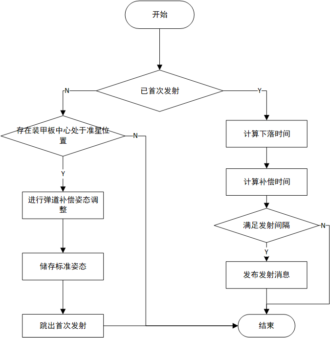

RMUC2022旋转前哨站预测器
=================================================
:Authors:
      Kinsley_gu

:Contact: 1992664345@qq.com
:Date: 2022/10/07
:Copyright: This document has been placed in the public domain.

概述
----------------------------
在RMU竞赛中，前哨站的中部装甲为可旋转设计，于比赛开始30秒至比赛开始三分钟期间匀速随机方向旋转。在装甲板旋转期间累积伤害500+将获得金币激励。

本文档将阐述匀速速率情况下考虑到水平空阻与距离因素导致的下落时长预测模型

.. note:: 旋转前哨站预测器相关代码位于 ``bubble_contrib/bubble_aiming/predictor/outpostPredictor.py`` 模块下

流程
------------------------

坐标系定义
---------------------------

云台坐标系通过\ :math:`yaw`\ 轴与\ :math:`pitch`\ 轴连接在底盘上，初始坐标系\ :math:`O_{gimbal\_xyz}`\。
其中前方为\ :math:`{x}`\ 正方向，左方为\ :math:`{y}`\ 正方向，上侧为\ :math:`{z}`\ 正方向。重力加速度 :math:`g` 方向为 :math:`z` 轴负方向。

模型符号说明
--------------------------

  .. list-table::
    :widths: 10 20 20
    :header-rows: 1

    * - 符号
      - 符号说明
      - 备注
    * - :math:`\rho`
      - 弹丸的密度
      - 在下述模型中单位为kg/m^3
    * - :math:`C`
      - 球体在空气中所受摩擦系数
      - 需事先输入，为定值
    * - :math:`S`
      - 弹丸迎风面积
      - 单位为m^2，由弹丸初速度推测弹丸类型后直接赋予
    * - :math:`v_{x0}`
      - 弹丸初速度
      - 外部传入
    * - :math:`v_{x}`
      - 弹丸更迭速度
      - 考虑到空阻的速度
    * - :math:`f_{x}`
      - 所受空气阻力
      - 仅考虑在 :math:`{x}`\ 方向上的阻力  
    * - :math:`t`
      - 弹丸从枪管飞出到击打到装甲板的飞行时间	
      - 也就是后续出现的距离补偿时间:math:`t_{distance}`        
    * - :math:`s`
      - 弹丸到目标装甲板的距离
      - 通过外部传入     

模型适用条件
---------------------------
1. 弹丸垂直方向空气阻力大小可忽略
   
2. 弹丸弹速理想，未出现掉速情况

数学推导
---------------------------

1.空气阻力模型
******************

考虑在比赛过程中子弹飞行状态下斜抛少，因而以下空气阻力模型仅考虑水平方向（:math:`{x}`\ 方向）所受空气阻力。

球体受空气阻力面积为球体迎风截面，所需球体半径由外部传入。

.. math::

  S = \pi * r ^2

  f_{x} = C \rho S  v_{x}^2 / 2 

2.速度更迭模型
******************

根据牛顿第二定律：物体的加速度 a 跟物体受到的合外力 F 成正比，跟物体的质量 m 成反比，有公式 :math:`F=ma` 。同时根据加速度定义有，加速度在数值上等于单位时间内速度的变化量，即速度对时间的一阶导数 :math:`a = dv_{x} / dt`。

.. math::

  - f_{x} / m = dv_{x} / dt
  
由上述空气阻力模型所得结论对于不同速度下空气阻力大小的表达式，可通过将 :math:`f_{x}` 的表达与速度对时间的一阶导数联立可得后续推导公式。

.. math::

  - f_{x} / m = dv_{x} / dt
  
  C \rho S v_{x}^2 dt / 2 m = - dv_{x} / v_{x}^2

  v_{x} = v_{x0} / (k_{1} v_{x0} t +1)
  
功能实现
---------------------------

操作手将旋转装甲板目标中心位置置于操作界面准心位置后先行进入弹道补偿流程（此部分代码于 ``bubble_contrib/bubble_aiming/predictor/outpostPredictor.py`` 模块下）。
待补偿成功后，得到:math:`compensator`，计算标准位置信息并储存于 :math:`standard` 中。

.. math::
  standard_{pitch} = gimbal_{pitch} + compensator_{pitch}

后续将将云台信息 :math:`gimbal` 与储存的标准姿态 :math:`standard_{yaw}` 与 :math:`standard_{pitch}` 进行比对后输出两者差值，以调整回标准姿态位置。

通过循环更迭速度 :math:`v_{x}` 与下坠时间 :math:`t_{distance}` 得到下落时长输出值作为在一定距离情况下辅助射击旋转前哨站的调整参数之一（另外一项是上下位机通讯和枪管相应的时长）。
得到下坠时间后，可获得当前状态下从发射射击指令到弹丸射击到目标装甲板的总时间。

.. math::
  `t_{compensator} = t_{respond} + t_{distance}` 

将上一帧识别到装甲板但至今未发射的数据时间戳与此刻时间戳进行比对，若两者差的绝对值与 :math:`t_{compensator}` 在一定范围即可视为此时发射弹丸理论情况下应能击中目标装甲板。

结语
----------------

文档阐述了当前版本Bubble中旋转前哨站预测模块实现的过程，在不同粘滞度情况下需要更改摩擦系数进行使用。不适用于弹道轨迹过高等需要考虑 :math:`f_{y}` 的情况。