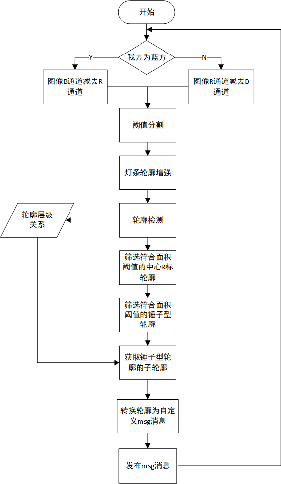

RMUC2022能量机关识别器
=================================================
:Authors:
    HarryWen

:Contact: 858601365@qq.com
:Date: 2022/09/10
:Copyright: This document has been placed in the public domain.

概述
------------------------------------------------
在RMU竞赛中， 能够准确预测和击打能量机关是极为重要的。而预测的基础是识别器能够准确识别中心R标和区分出未被激活的能量机关。
不同于装甲板灯条的识别，能量机关目标形状不规则，不能简单的使用外接矩形去完成识别任务。该文档将阐述如何使用传统视觉对不规则形状的目标进行识别。

.. note:: 能量机关识别器的相关代码位于 ``bubble_detector/bubble_rune`` 模块下

流程
------------------------------------------------

图像预处理
------------------------------------------------

1. 图像二值化处理：分离图像的BGR通道。将其中的B和R两通道相减，并对相减的结果进行阈值分割，得到需要击打颜色的二值化图像

2. 灯条轮廓增强：对二值化图像进行多次图像形态学上的闭运算，使灯条轮廓变得完整。（此处需避免多次闭运算导致不同扇叶灯条黏连）

功能实现
################################################
均使用OpenCV内的函数实现

| cv::split() 将图像从多通道分离为多个单通道图像。
| cv::threshold(type = cv::THRESH_BINARY) 筛选出图像中需要的灰度部分，并转化为二值化的图像。
| cv::morphologyEx(op = cv.MORPH_CLOSE) 形态学闭操作, 闭合轮廓。内部形参定义请参见 `morphologyEx <https://docs.opencv.org/4.x/d4/d86/group__imgproc__filter.html#ga67493776e3ad1a3df63883829375201f>`__

核心代码实现
################################################
获取指定颜色的二值化图像

.. code-block:: c++

    cv::Mat GrayFilter(cv::Mat &image, bool mode, int grayThres)
    {
        cv::Mat grayImg;
        cv::Mat channels[3];
        cv::split(image, channels);
        if (mode)
        {
            grayImg = channels[2] - channels[0];
        }
        else
        {
            grayImg = channels[0] - channels[2];
        }
        cv::threshold(grayImg, grayImg, grayThres, 255, cv::THRESH_BINARY);
        return grayImg;
    }

识别未被激活的能量机关
------------------------------------------------

能量机关包含两种形态，一种为未被激活的锤子形和激活成功的宝剑形。

由于两者的面积不同，通过设置合适的面积上下限，筛选出二值化图像中的锤子形轮廓。

根据轮廓的层级关系，提取锤子型轮廓的子轮廓，即目标轮廓。

功能实现
################################################

| filterArea() 筛选出符合面积要求的轮廓 
| cv::contourArea() 轮廓面积计算
| cv::findContours(mode = cv::CV_RETR_TREE) 检测所有轮廓，便于提取父级轮廓的内部子轮廓。内部详细定义请参见

核心代码实现
################################################
筛选轮廓的面积

.. code-block:: c++

    std::vector<std::vector<cv::Point>> filterArea(std::vector<std::vector<cv::Point>> contours, int minArea, int maxArea)
    {
        std::vector<int> hierarchyIdList;
        std::vector<std::vector<cv::Point>> matchContoursList;

        for (int contours_id = 0; contours_id < contours.size(); contours_id += 1)
        {
            const std::vector<cv::Point> &contour = contours[contours_id];
            double area = cv::contourArea(cv::Mat(contour));

            if (minArea < area && area < maxArea)
            {
                matchContoursList.push_back(contours[contours_id]);
                hierarchyIdList.push_back(contours_id);
            }
        }
        return matchContoursList;
    }

识别能量机关的中心R标
------------------------------------------------

中心R标相较于能量机关的扇叶面积较小，故直接采用面积法，筛选较小面积即可完成中心R标的轮廓提取

功能实现
################################################
与识别未被激活的能量机关部分相同

相关内容 
------------------------------------------------
在识别之后需要对能量机关轨迹进行预测，具体详见能量机关预测器

结语
------------------------------------------------
文档阐述了当前版本Bubble中能量机关识别器实现的过程。使用面积法筛选未被激活能量机关的轮廓。然后使用轮廓层级关系获取轮廓子层级即需要击打的目标，从而完成能量机关的识别任务。

